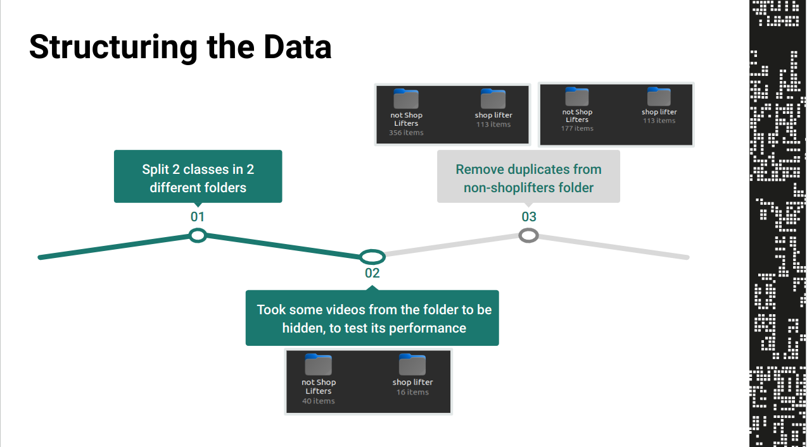
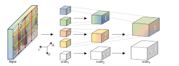
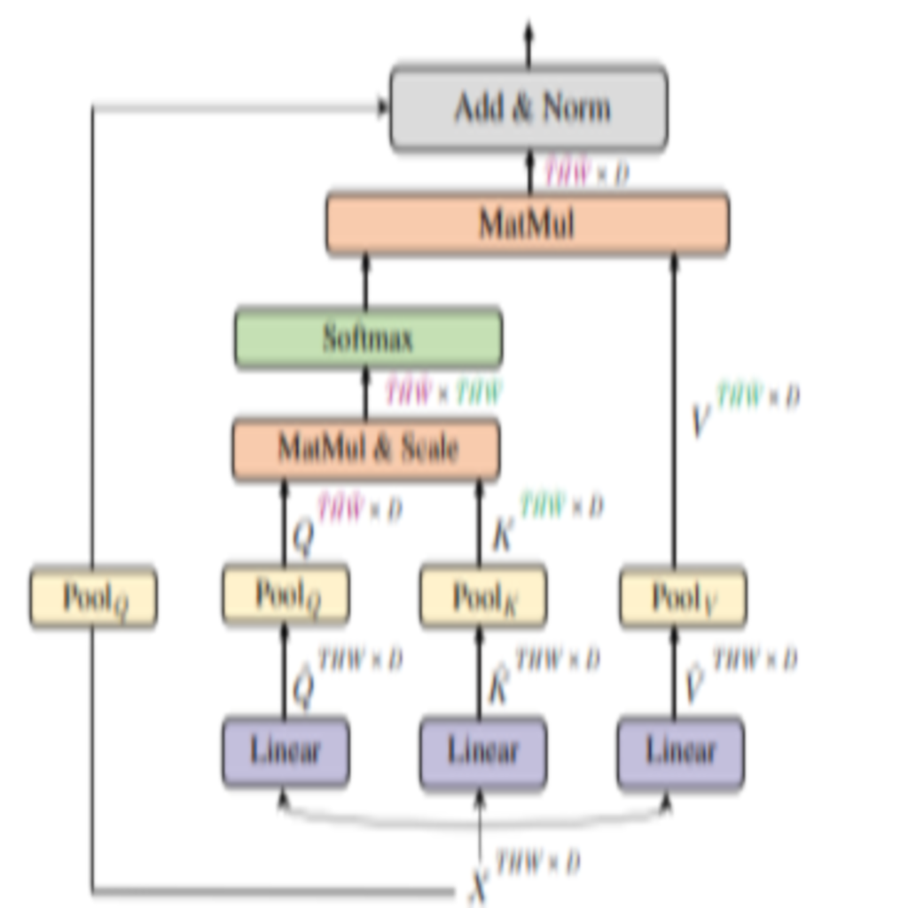

# The Eye of Parador

## Description
The Eye of Parador is a shoplifting action recognition model inspired by the iconic Eye of Sauron from "The Lord of the Rings". "The Eye always watches". 
This project was developed as a solution during the "Machathon 5.00" hackathon organized by STP.

Shoplifting is a significant issue for retail businesses, leading to losses in revenue and increased security concerns. The Eye of Parador utilizes computer vision techniques to detect and recognize shoplifting actions in real-time, providing an efficient solution to tackle this problem.

## Overview of Data
The dataset used for training the Eye of Parador model consists of annotated video footage capturing various shoplifting scenarios. Each video clip is labeled with the corresponding shoplifting action, such as concealing items, removing security tags, or attempting to leave the store without payment.

The dataset is divided into two main categories: 
1. Shoplifting Actions: Video clips depicting different shoplifting behaviors.
2. Non-Shoplifting Actions: Video clips showing normal shopping activities.

## Data Structure
The dataset is structured as follows:
- **Shoplifting_Data/**
  - **Action_1/**
    - *clip1.mp4*
    - *clip2.mp4*
    - ...
  - **Action_2/**
    - *clip1.mp4*
    - *clip2.mp4*
    - ...
  - ...
- **Non_Shoplifting_Data/**
  - *clip1.mp4*
  - *clip2.mp4*
  - ...
  

## Methodology
The Eye of Parador model employs a deep learning-based approach for shoplifting action recognition. The methodology involves the following steps:
1. **Data Preprocessing:** Video clips are preprocessed to extract relevant frames and standardize the input format.
    - Sampling Frames using a normal distribution to pay attention to the middle frames where shoplifting mostly happens.
    - Temporal Subsampling by a moving window apporach to help capture all the information and to help create more training examples.
    - We select 16 frames.
    - We reshape each frame to 224,224.
    - We do horizontal flipping, noise addition and rotations as a part of our data augmanetaton porcess.
    - Each training batch has a shape of (Batch_size,N_channels=3, N_frames=16, 224, 224)

2. **Model Architecture:** A **Multi Scale Vision Transformer** 
 

    - Multiscale Processing: MViT processes both spatial and temporal information at multiple scales. It leverages multiple levels of spatial and temporal resolutions to capture features at different granularities, enabling the model to understand both global context and fine details within video sequences.

    - Patch-based Processing: Similar to ViT, MViT divides video frames into fixed-size patches and flattens them into sequences, which are then fed into transformer layers. 

    - Self-Attention Mechanism: MViT employs self-attention mechanisms within its transformer layers to capture long-range dependencies and relationships between patches in both spatial and temporal dimensions.

    - Positional Encoding: To preserve spatial and temporal information, MViT incorporates positional encodings that encode the spatial and temporal positions of patches within the input sequence. 

    - Hierarchical Processing: MViT may include hierarchical processing mechanisms to handle multiscale features effectively. 

    
 
3. **Training:** The model is trained using the annotated dataset, optimizing for classification of shoplifting and non-shoplifting actions .
4. **Evaluation:** The trained model is evaluated on a separate test set to assess its performance in detecting shoplifting behaviors.
5. **Deployment:** The finalized model is deployed for real-time inference, integrated into existing surveillance systems or security frameworks.

